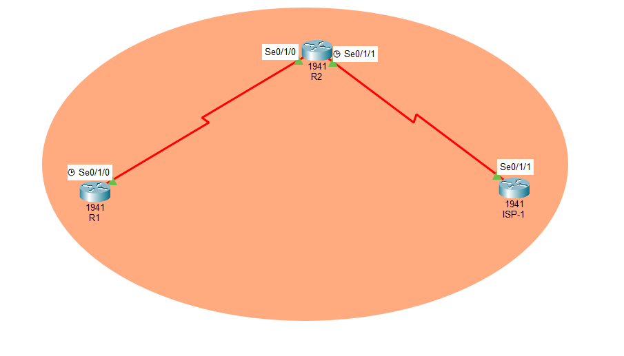
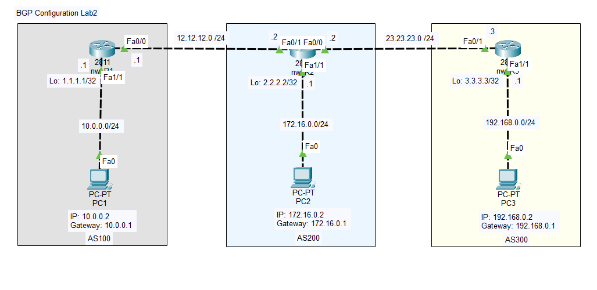
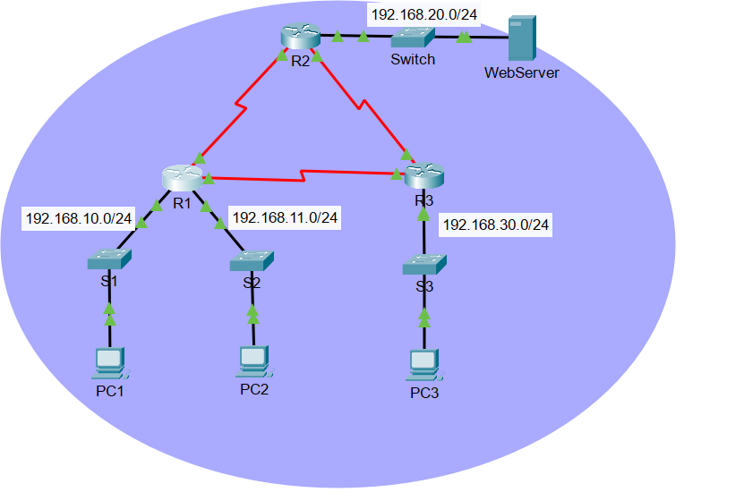
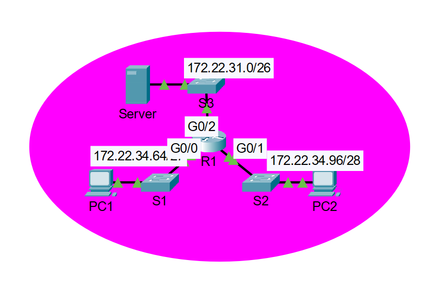
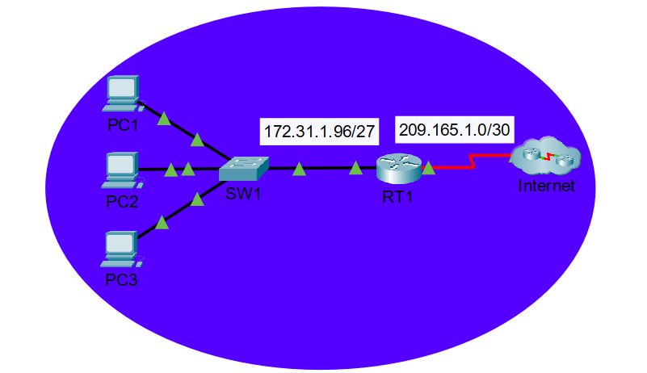

# Packet Tracer Labs


Hands-on networking labs built with **Cisco Packet Tracer**, covering inter-domain routing with **BGP**, intra-domain routing with **OSPFv2** and traffic filtering with **access control lists (ACLs)**. Each lab ships with the topology file, the original statement when available, annotated screenshots, and a written report (*compte rendu*) containing the exact commands used.

---

## Table of contents

- [Repository structure](#repository-structure)
- [Labs overview](#labs-overview)
- [Lab 1 - eBGP basics](#lab-1---ebgp-basics)
- [Lab 2 - BGP across three autonomous systems](#lab-2---bgp-across-three-autonomous-systems)
- [Lab 3 - Access control lists (ACLs)](#lab-3---access-control-lists-acls)
- [OSPF - Single-area OSPFv2](#ospf---single-area-ospfv2)
- [Getting started](#getting-started)
- [Verification cheat sheet](#verification-cheat-sheet)
- [Key takeaways](#key-takeaways)
- [Conventions](#conventions)
- [Author](#author)

---

## Repository structure

```
packet-tracer-labs/
├── README.md
├── .gitignore
├── configurationPackTracer/          # Single-Area OSPFv2 Packet Tracer activity
│   └── 2.7.1 ... Single-Area OSPFv2 ...
├── lab-bgp-config/
│   └── BGP_lab2.pkt                  # BGP topology (Lab 2 base file)
├── lab1-ebgp-basic/
│   ├── Screenshots/                  # R1, R2, ISP-1 captures
│   ├── topology.png                  # Topology screenshot (used in README)
│   ├── BGP-Lab1.pkt                  # Packet Tracer topology
│   ├── EnonceLab1.pdf                # Original lab statement (French)
│   └── Lab1_eBGP_Compte_Rendu.pdf    # Lab report with commands + screenshots
├── lab2-bgp-configuration/
│   ├── Screenshots/                  # Router configs, routing tables, pings
│   ├── topology.png                  # Topology screenshot (used in README)
│   ├── Lab2_BGP_Compte_Rendu.pdf     # Lab report with commands + screenshots
│   └── Practice Lab - BGP Configuration 2 v1.pkt
└── lab3-ACLs/
    ├── 01.Configure Numbered Standard ACLs.pka
    ├── 01.Configuring Standard ACLs Instructions.pdf
    ├── 02.Configuring Extended ACLs Scenario 1.pka
    ├── 02.Configuring Extended ACLs Scenario 1 Instructions IG.pdf
    ├── 03.Configuring Extended ACLs Scenario 3.pka
    ├── 03.Configuring Extended ACLs Scenario 3 Instructions IG.pdf
    ├── Compte_rendu_01_ACL_standard.pdf
    ├── Compte_rendu_02_ACL_etendue_scenario1.pdf
    ├── Compte_rendu_03_ACL_etendue_scenario3.pdf
    ├── topology-01-standard.png                 # Topology screenshots (used in README)
    ├── topology-02-extended-scenario1.png
    └── topology-03-extended-scenario3.png
```

## Labs overview

| Lab | Topic | Routers | Scope | Deliverables |
|---|---|---|---|---|
| [Lab 1](lab1-ebgp-basic) | eBGP between a company and its ISP | R1, R2, ISP-1 (Cisco 1941) | AS 65000, AS 65001 | `.pkt`, statement, report, screenshots |
| [Lab 2](lab2-bgp-configuration) | eBGP chain across three ASes | nw_R1, nw_R2, nw_R3 (Cisco 2811) | AS 100, AS 200, AS 300 | `.pkt`, practice file, report, screenshots |
| [Lab 3](lab3-ACLs) | Standard and extended ACLs (3 activities) | R1-R3, R1, RT1 | Traffic filtering | `.pka`, statements, 3 reports |
| [OSPF](configurationPackTracer) | Single-area OSPFv2 | see activity | Area 0 | `.pkt` |

---

## Lab 1 - eBGP basics

A company (**AS 65000**) connects to an ISP (**AS 65001**). The ISP originates a default route and R2 learns it over eBGP. R1 reaches the outside world through a static default route towards R2.

**Topology**

<p align="center">
  
  <br><em>Lab 1 - R1 (AS 65000) - R2 (AS 65000) - ISP-1 (AS 65001)</em>
</p>

**Addressing**

| Device | Interface | IP address | Mask |
|---|---|---|---|
| R1 | Serial0/1/0 (DCE) | 198.133.219.1 | 255.255.255.248 |
| R2 | Serial0/1/0 | 198.133.219.2 | 255.255.255.248 |
| R2 | Serial0/1/1 (DCE) | 209.165.200.2 | 255.255.255.252 |
| ISP-1 | Serial0/1/1 | 209.165.200.1 | 255.255.255.252 |
| ISP-1 | Loopback0 (web server) | 10.10.10.10 | 255.255.255.255 |

**What it demonstrates**

- Enabling BGP and declaring an eBGP neighbor (`router bgp`, `neighbor ... remote-as`)
- Advertising a prefix with `network ... mask ...`
- Receiving a default route from the ISP (`B*` route with administrative distance 20)
- End-to-end test from R1 to the simulated web server

Full commands and evidence: [`Lab1_eBGP_Compte_Rendu.pdf`](lab1-ebgp-basic/Lab1_eBGP_Compte_Rendu.pdf)

## Lab 2 - BGP across three autonomous systems

Three routers in a line, each in its own AS, with a LAN and a loopback per router. R2 sits in the middle and relays routes between R1 and R3.

**Topology**

<p align="center">
  
  <br><em>Lab 2 - AS 100, AS 200 and AS 300, one LAN and one PC behind each router</em>
</p>

**What it demonstrates**

- Two eBGP sessions on a transit AS (R2)
- Explicit `bgp router-id` and loopback advertisements
- Route propagation across ASes, visible as `B` entries in `show ip route`
- Full connectivity between the three LANs, validated with pings (TTL 126 across two routers, 125 across three)

Full commands and evidence: [`Lab2_BGP_Compte_Rendu.pdf`](lab2-bgp-configuration/Lab2_BGP_Compte_Rendu.pdf)

## Lab 3 - Access control lists (ACLs)

Three Packet Tracer activities on filtering traffic with ACLs: one **standard** ACL activity and two **extended** ones. Each activity has its own report with the topology, the commands explained line by line, and pass/fail tests backed by screenshots.

| # | Activity | ACL type | Where it is applied | Report |
|---|---|---|---|---|
| 01 | Numbered standard ACLs | Standard (ACL 1) | R2 `G0/0` out and R3 `G0/0` out | [`Compte_rendu_01_ACL_standard.pdf`](lab3-ACLs/Compte_rendu_01_ACL_standard.pdf) |
| 02 | Extended ACLs, scenario 1 | Extended numbered (ACL 100) and named (`HTTP_ONLY`) | R1 `G0/0` in and R1 `G0/1` in | [`Compte_rendu_02_ACL_etendue_scenario1.pdf`](lab3-ACLs/Compte_rendu_02_ACL_etendue_scenario1.pdf) |
| 03 | Extended ACLs, scenario 3 | Extended named (`ACL`) | RT1 `G0/0` in | [`Compte_rendu_03_ACL_etendue_scenario3.pdf`](lab3-ACLs/Compte_rendu_03_ACL_etendue_scenario3.pdf) |

### 01 - Standard ACLs

Two policies on a three-router network running EIGRP: `192.168.11.0/24` must not reach the WebServer (R2), and `192.168.10.0/24` must not reach `192.168.30.0/24` (R3). All other traffic stays allowed.

<p align="center">
  
  <br><em>Activity 01 - three LANs, a WebServer behind R2, EIGRP between routers</em>
</p>

```
R2(config)# access-list 1 deny 192.168.11.0 0.0.0.255
R2(config)# access-list 1 permit any
R2(config)# interface GigabitEthernet0/0
R2(config-if)# ip access-group 1 out
```

A standard ACL only matches the **source** address, so it is placed **close to the destination**. Blocked pings return `Destination host unreachable` from the router that applies the ACL.

### 02 - Extended ACLs, scenario 1

PC1 may only use **FTP** (plus ping) towards the server, PC2 may only use the **web** (plus ping), and PC1 and PC2 cannot ping each other. Part 1 builds a numbered ACL step by step with the `?` help, part 2 builds a named one.

<p align="center">
  
  <br><em>Activity 02 - R1 connects the PC1 LAN (/27), the PC2 LAN (/28) and the server LAN (/26)</em>
</p>

```
R1(config)# access-list 100 permit tcp 172.22.34.64 0.0.0.31 host 172.22.34.62 eq ftp
R1(config)# access-list 100 permit icmp 172.22.34.64 0.0.0.31 host 172.22.34.62
R1(config)# interface gigabitEthernet 0/0
R1(config-if)# ip access-group 100 in

R1(config)# ip access-list extended HTTP_ONLY
R1(config-ext-nacl)# permit tcp 172.22.34.96 0.0.0.15 host 172.22.34.62 eq www
R1(config-ext-nacl)# permit icmp 172.22.34.96 0.0.0.15 host 172.22.34.62
R1(config)# interface gigabitEthernet 0/1
R1(config-if)# ip access-group HTTP_ONLY in
```

Only `permit` rules are needed: the implicit `deny any` at the end blocks everything else, including PC1 to PC2.

### 03 - Extended ACLs, scenario 3

A named extended ACL blocks one service per host towards two Internet servers: **HTTP and HTTPS** for PC1, **FTP** for PC2, and **ICMP** for PC3. Servers are only known by IP address, so one rule is written per host, server and port.

<p align="center">
  
  <br><em>Activity 03 - LAN 172.31.1.96/27 behind RT1, connected to the Internet</em>
</p>

```
RT1(config)# ip access-list extended ACL
RT1(config-ext-nacl)# deny tcp host 172.31.1.101 host 64.101.255.254 eq 80
RT1(config-ext-nacl)# deny tcp host 172.31.1.101 host 64.101.255.254 eq 443
RT1(config-ext-nacl)# deny tcp host 172.31.1.102 host 64.101.255.254 eq 21
RT1(config-ext-nacl)# deny icmp host 172.31.1.103 host 64.101.255.254
RT1(config-ext-nacl)# permit ip any any
RT1(config)# interface g0/0
RT1(config-if)# ip access-group ACL in
```

The excerpt shows the rules for Server1 only; the full ACL (9 rules, the same rules repeated for Server2) is in the report. The final `permit ip any any` is mandatory, otherwise the implicit deny would block all remaining traffic.

**What Lab 3 demonstrates**

- Standard vs extended ACLs: what each can match, and where to place it
- Wildcard masks (`0.0.0.31` for a /27, `0.0.0.15` for a /28, `0.0.0.255` for a /24)
- Numbered ACLs (`access-list 100 ...`) vs named ACLs (`ip access-list extended NAME`)
- Rule order, the implicit `deny any`, and the `in` / `out` direction on an interface
- Verification with `show access-list` (rules and match counters) and targeted pass/fail tests

## OSPF - Single-area OSPFv2

Packet Tracer activity on single-area OSPFv2 (area 0). Open the `.pkt` file in [`configurationPackTracer`](configurationPackTracer) and follow the activity instructions embedded in the file.

---

## Getting started

**Requirements**

- [Cisco Packet Tracer](https://www.netacad.com/) 8.x (free with a Cisco Networking Academy account)
- Any PDF reader for the reports

**Clone and open**

```bash
git clone https://github.com/AjmiOns/packet-tracer-labs.git
cd packet-tracer-labs
```

Open any `.pkt` or `.pka` file with Packet Tracer (`File > Open`). Router configurations are already applied; you can also replay them from the command blocks in each report.

> Packet Tracer interface names depend on the modules installed. Lab 1's statement uses `S0/0/x` while the topology file uses `Serial0/1/x`; addressing is identical.

## Verification cheat sheet

| Command | Where | What it tells you |
|---|---|---|
| `show ip route` | any router | Routing table; `B` = BGP route, `B*` = BGP default route |
| `show ip bgp` | any BGP router | BGP table: prefixes, next hop, AS path |
| `show ip bgp summary` | any BGP router | Neighbor state and number of prefixes received |
| `show access-list` | any router with ACLs | Rules in order, with match counters |
| `show ip interface <int>` | any router with ACLs | Which ACL is applied on the interface, and in which direction |
| `ping <ip>` | routers and PCs | End-to-end reachability |
| `copy running-config startup-config` | any router | Persist the configuration |

## Key takeaways

- **eBGP neighbors must be reachable** and each side needs the correct `remote-as`; a typo in the neighbor address leaves a session stuck instead of failing loudly.
- **`network` statements must match the routing table exactly** (prefix and mask), otherwise the route is not advertised.
- **A single-homed company does not need BGP.** A static default route towards the ISP is enough. BGP is justified in multi-homed designs with several ISPs, where path selection and redundancy matter.
- **TTL is a quick hop counter** when validating multi-router paths with ping.
- **Place standard ACLs near the destination and extended ACLs near the source.** A standard ACL only sees the source address, so putting it close to the source would block too much.
- **ACLs end with an implicit `deny any`.** List what is allowed, or finish with `permit ip any any` when you only want to block specific flows.
- **Rule order matters.** The first matching rule wins, so specific rules go before general ones.
- **A router-generated `Destination host unreachable` means an ACL (or routing) decision**, whereas `Request timed out` points to a lost or silently dropped packet.

## Conventions

- **Folders**: `labN-short-topic`, lowercase, hyphenated (`lab3-ACLs` keeps the course naming).
- **Files**: `.pkt` / `.pka` for topologies, `.pdf` for reports and statements; filenames mix underscores, hyphens and numeric prefixes depending on the lab.
- **Commits**: [Conventional Commits](https://www.conventionalcommits.org/) (`feat`, `docs`, `chore`, `fix`), one logical change per commit, scoped by lab (for example `docs(lab1): add R2 screenshots`).

## Author

Ons, engineering student at TEK-UP University, Tunisia.
[GitHub](https://github.com/AjmiOns) · [LinkedIn](https://www.linkedin.com/in/ons-ajmi--)

Labs completed as part of the routing protocols course. Feedback and suggestions are welcome through issues.
